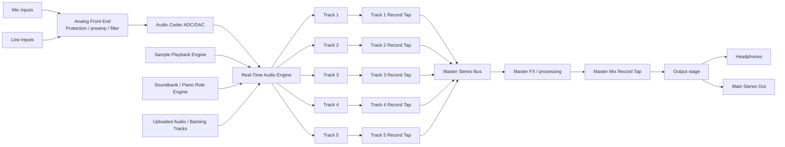

# IUS Audio Signal-Flow Diagram
Revision B

## Audio signal-flow Mermaid reference

## Behavior notes
- Each track has separate Arm / Sample, Track Rec, and Mic Rec behavior.
- Track Rec prints the track behavior/output in stereo.
- Mic Rec is hold-to-record sampling on that track.
- The master has separate Mic Rec and Mix Rec behavior.
- The monitor is fed from track/master waveform buffers, not from an oscilloscope-only path.

