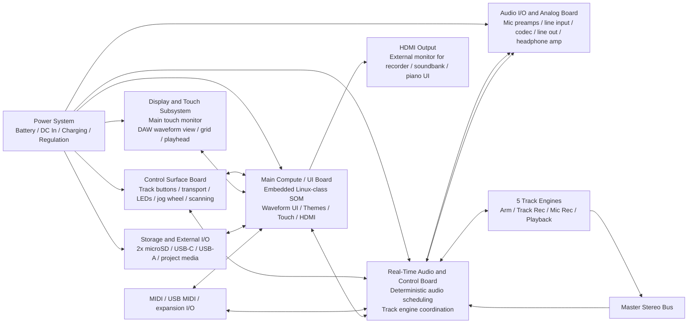

# IUS Top-Level Hardware Block Diagram
Revision B

## Top-level diagram content to draw
- Main Compute / UI Board
- Real-Time Audio and Control Board
- Audio I/O / Analog Board
- Control Surface Board
- Display and Touch Subsystem
- Storage and External I/O Subsystem
- Power System
- HDMI External Display Path
- Master Bus and Track Engine relationships

## Top-level Mermaid reference

