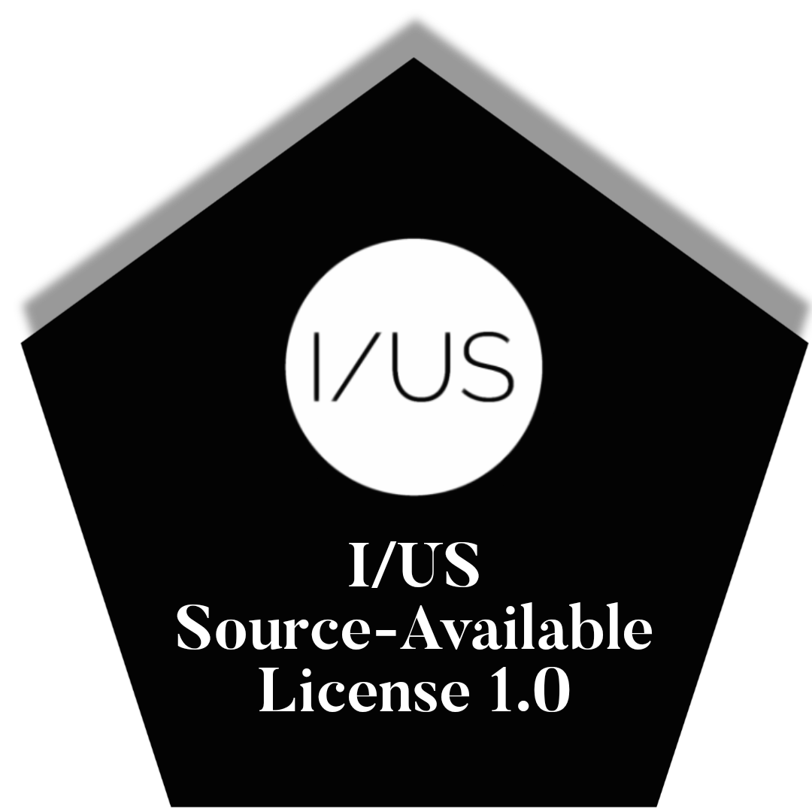

# I/US Official Sequencer

**Live demo**  
* **[Open in New Page](https://iusmusic.github.io/IUS-DMS/)**

## I/US DMS

**I/US-DMS is a browser-based prototype of the I/US Official Sequencer.**

## What this project is

**This repository brings together two connected parts of the same idea:**

**Software prototype**  
* A browser-based sequencer used to test interface behaviour, playback workflow, sound browsing, track control, recording direction, and interaction design

**Hardware concept**  
* Early notes, layouts, schematics, and supporting documents for the future physical I/US device

The software side is the hands-on prototype you can run now.  
The hardware side shows the broader direction the project is moving toward.

## Current status

This is an early public prototype shared to organise ideas, test workflows, document progress, and gradually connect the software prototype to the larger hardware vision behind I/US.

The project is now moving beyond the earlier prototype direction and into a more complete **Revision B** architecture focused on:

* high-quality sampling
* multitrack workflow
* waveform-based DAW monitoring
* touch editing
* modular hardware
* studio-quality stereo recording

## What this repo contains

* Browser prototype (`index.html`)
* Interface experiments and sequencing workflow development
* Soundbank structure for sample testing
* Early hardware and layout notes
* Revision B block schematic and hardware planning files
* Industrial design and diagram briefing documents tied to the wider I/US system

## Features

* Multi-track sequencing
* Full piano keyboard path
* Soundfont-backed piano with fallback behaviour
* Sample library and custom sample loading
* BPM control
* Looping
* Track playback controls
* Theme / display switching where available
* Microphone-related features where supported
* Record monitor and DAW workflow experiments
* Soundbank and library workflow support

## Revision B Architecture Update

* Reframed the device from a sequencer-first prototype into a sampling-first multitrack workstation

* Kept the system as a 5-track DAW layout with a dedicated master section

* Replaced the oscilloscope-style monitor concept with a DAW-style waveform monitor direction

* Defined the monitor as a fixed shared display with vertically compressing track lanes

* Set monitor lane colors by track number:

  * Track 1 red
  * Track 2 blue
  * Track 3 white
  * Track 4 red
  * Track 5 blue

* Defined silent but engaged tracks to write as flat lines rather than disappearing

* Set the monitor to preserve recorded waveform history after capture for future edit and punch-in workflows

* Clarified that the monitor must support touch interaction for waveform selection, cursor placement, and future edit-from-position recording

* Added the requirement for visible waveform grids to support precise editing

* Added a dedicated right-side scroll / jog control for surgical waveform navigation when touch alone is not precise enough

* Split per-track recording behavior into separate functions:

  * Arm / Sample
  * Track Rec
  * Mic Rec

* Track Rec captures the track behavior/output in stereo

* Mic Rec is a separate hold-to-record sampling path

* Uploaded audio can be used as a backing-track / waveform-track source

* Added the requirement for a separate Master Mix Rec path in addition to Master Mic Rec

* Defined Master Mix Rec as the stereo capture path for all tracks and master performance output

* Confirmed that the master section remains a controller/master-bus section rather than becoming a normal track lane

* Reworked the hardware direction from a single-DSP-centered prototype into a dual-domain architecture

* Defined a Main Compute / UI subsystem for touch DAW display, themes, storage management, and HDMI output

* Defined a separate real-time audio/control subsystem for deterministic low-latency audio behavior

* Kept the audio design focused on studio-quality recording at 24-bit / 48 kHz minimum, with headroom for higher-quality operation later

* Defined the analog/digital boundary more clearly around codec, preamp, line conditioning, output stage, and digital track engine domains

* Expanded the storage direction to support multiple media paths, including more than one microSD slot and external storage workflows

* Added expanded I/O direction including additional USB-C, USB-A, and HDMI support

* Defined HDMI as an external display path for the recorder screen, sound bank monitor, and piano UI

* Rewrote the hardware plan as an open-source-ready modular board split:

  * Main Compute / UI Board
  * Real-Time Audio and Control Board
  * Audio I/O / Analog Board
  * Control Surface Board
  * Display / Touch Subsystem

* Rewrote the block schematic, hardware architecture, and layout documents around Revision B instead of the earlier Revision A prototype assumptions

* Added dedicated block-diagram and industrial-design briefing documents for future diagramming and hardware drawing work

## 14 March 2026

* Kept the app as a 5-track sequencer

* Decoupled the keyboard size from the 31-step sequencer

* Replaced the limited keyboard with a full piano keyboard

* Upgraded the keyboard path to use a soundfont-backed piano with fallback behavior

* Added a new Record Monitor below the master track

* Wired it so it shows only armed or recording tracks

* Made the monitor responsive so multiple armed tracks are visible as needed

* Added track color mapping so recordings are visually tied to their source track

* Moved the Settings inside the Library / Sound Bank monitor

* Reduced the left monitor/bank panel width by about 10%

* Added Skip Back, Play/Pause, and Skip Forward controls

* Wired the new UI so the controls and monitor behavior are connected

* Kept the master track as controller rather than using it as the recording lane

## 13 March 2026

* Added a dedicated master track panel above the regular tracks

* Included:

  * **FX toggle**
  * **Midi/Bank mode**
  * **Reverb**
  * **Delay**
  * **Distortion**
  * **Volume**
  * **Play**
  * **Rec**
  * **Sustain**

* Added a **left-side main monitor** panel

* Added an always-visible **oscilloscope** inside the main monitor

* Wired it to the **master output analyser**

* Added a persistent **Sound Library** view inside the main monitor

* Included sound browsing, file loading, search, and assignment workflow support

* Added functional **Reverb**, **Delay**, and **Distortion** controls on all tracks

* Presented the controls as physical-style knobs and wired them to audio behavior

* Added a **minimal physical EQ section** in the top area

* Wired the EQ section to the **master bus**

## How to open the prototype

* Step 1. Extract the zip file if needed.

* Step 2. Open the I/US Official Sequencer folder.

* Step 3. Open `index.html` in a modern browser.

* Step 4. The prototype will load with the main sequencer view.

## How to use the preview

* Step 1. Open `index.html` in your browser.

* Step 2. Use the main monitor and top controls to access the current workspace.

* Step 3. Open the **Library / Sound Bank** panel to browse available sounds.

* Step 4. Load audio files if you want to add custom sounds.

* Step 5. Click a sound in the library to arm or assign it for use.

* Step 6. Click a step on any track to place the selected sound into the sequence.

* Step 7. Use the track **Play** button to hear that track.

* Step 8. Use **Stop** to stop playback and reset the position as needed.

* Step 9. Change **BPM** to alter playback speed.

* Step 10. Use the **Loop** control to keep playback cycling.

* Step 11. Use the transport controls to move through playback.

* Step 12. Use the track controls to adjust playback and performance behavior.

* Step 13. Use the **Library / Sound Bank** monitor settings area for available display and sound options.

* Step 14. Use the full piano keyboard to play notes across a wider range.

* Step 15. Use the theme / display controls if available to switch viewing modes.

## Custom sounds

* Place your own sample files in the `soundbank samples` folder.

* Supported file types depend on browser audio support. Common examples include:

  * `wav`
  * `mp3`
  * `ogg`

* Custom files placed in the samples folder appear in the **Custom** category in the sound library.

* Suggested naming rules for automatic grouping:

  * Files that start with `kick`, `snare`, `clap`, or `hihat` are treated as drum sounds
  * Files that start with `bass` are treated as bass sounds
  * Files that start with `synth` are treated as synth sounds
  * Files that start with `fx` are treated as effects sounds

## Notes

* Browser audio behavior may vary slightly depending on the browser

* Some features may require user interaction before audio playback is allowed

* Microphone-related features depend on browser permissions

* Support for custom formats depends on the browser’s built-in audio decoding capabilities

* This prototype is still evolving and some areas remain experimental

## Roadmap

* Continue expanding recording and workflow features

* Continue improving hardware documentation

* Continue aligning the browser prototype with the future physical device

* Add versioned releases

* Expand plugin / effect direction over time

## License

This repository is licensed under the **Mozilla Public License 2.0 (MPL-2.0)**.

This means:

* You may use, modify, and distribute this software

* You may create and sell real products and apps based on this code

* If you distribute modified versions of MPL-covered files, those modified files must remain available under the **MPL-2.0**

* The license applies to the code and covered source files in this repository

A full copy of the license should be included in the repository as `LICENSE`.

## Trademark and brand notice

**I/US**, **IUS**, and **IUS Music** are protected brand identifiers associated with the official I/US project.

The source code in this repository is licensed under the **Mozilla Public License 2.0**.  
That license applies to the code only.

The **MPL-2.0 does not grant any right to use the I/US name, the IUS name, the IUS Music name, the official logo, the visual identity, artwork, images, audio branding, or other protected brand assets** unless explicit written permission is given by **IUS Music**.

All rights in the **I/US**, **IUS**, and **IUS Music** brand identity are reserved.

Any fork, modified build, redistributed version, or commercial version must not imply official affiliation with or endorsement by the official **I/US** project unless written permission is given.

## Ownership

All rights not expressly granted under this license are reserved.

This license does not transfer ownership of the software, documentation, designs, concepts, hardware direction, brand identity, or any related intellectual property.

## No Trademark Rights

This license does not grant any right to use the names I/US, IUS, I/US Music, the official logo, the visual identity, artwork, images, audio branding, or any other protected brand assets.

Trademark and brand use are governed separately.

## No Warranty

This software, hardware prototype, and all associated materials are provided "as is", without warranty of any kind, express or implied, including but not limited to merchantability, fitness for a particular purpose, and noninfringement.

In no event shall the author or copyright holder be liable for any claim, damages, or other liability, whether in an action of contract, tort, or otherwise, arising from, out of, or in connection with the software or the use or other dealings in the software.

## Contact

For licensing requests, commercial rights, redistribution requests, or permission to use protected brand assets, prior written permission must be obtained from I/US Music.
If this repository is hosted publicly on GitHub, GitHub users may have certain limited rights to view and fork the repository through GitHub’s own platform functionality, as required by GitHub’s Terms of Service. No permission is granted beyond those minimum platform rights unless explicit written permission is given by I/US Music.

# I/US Source-Available License 1.0

